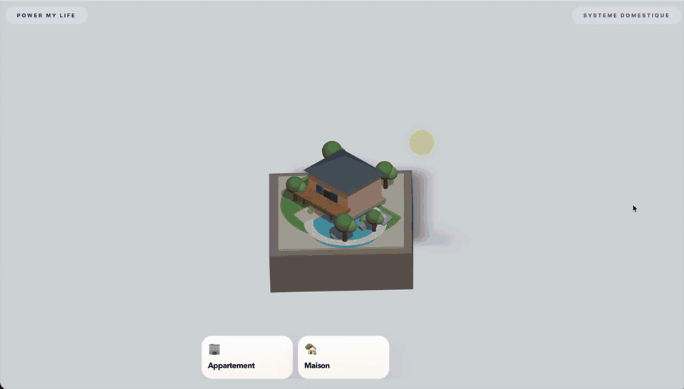

# Power My Life

Next.js 15 game prototype for the Defend Intelligence hackathon. The game puts players in charge of a home energy system: buy equipment, react to events, and balance comfort, autonomy, budget, and CO2 impact across the week.

## Demo

[Open the full demo preview](public/demo-preview.mp4)

## Local Development

Requirements:

- Node.js 22
- npm

Run the app locally:

1. Install dependencies:
   `npm ci`
2. Start the development server:
   `npm run dev`
3. Open:
   `http://localhost:3000`

## Coolify Deployment

This project is packaged to run as a single Dockerized Next.js service that Coolify can build from the repository root.

What is included:

- multi-stage `Dockerfile`
- `.dockerignore` for build hygiene
- Next.js production build configured with `output: "standalone"`
- stateless runtime with browser-side game state only

Recommended Coolify setup:

1. Push this repo to Git.
2. Create a new application in Coolify from that repository.
3. Use the repository root as the build context.
4. Select Dockerfile-based deployment.
5. Expose port `3000`.
6. Let Coolify route the generated public URL to the container.

Runtime assumptions:

- `NODE_ENV=production`
- `PORT=3000` by default, overridable by Coolify
- container binds on `0.0.0.0`

The production container starts the app from Next's standalone server bundle.

## Local Docker

For local Docker usage outside this Codex session:

1. Build and run with Compose:
   `docker compose up --build`
2. Open:
   `http://localhost:3001`

Or use plain Docker:

1. Build:
   `docker build -t power-my-life .`
2. Run:
   `docker run --rm -p 3001:3000 power-my-life`

The container listens on port `3000` internally and maps to `3001` locally in the provided compose file.

## Verification

Local checks:

- `npm run type-check`
- `npm run test:run`
- `npm run lint`
- `npm run build`

The GitHub Actions CI workflow runs `type-check`, `test:run`, and `build` on push and pull request.
